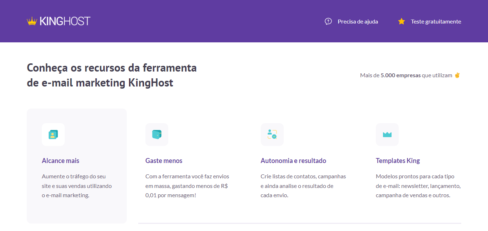

# Kinghost Landing Page

# Sobre o projeto

https://lp-kinghost.netlify.app/

A Kinghost Landing Page é uma aplicação Web Front-End responsiva construída durante o curso Codeboost, com o objetivo de colocar em prática as minhas habilidades em Saas.

# Tecnologias utilizadas

## Front end
- HTML
- CSS
- SASS

# Autora

Lorena Lima

https://www.linkedin.com/in/lorena-lima-b79a32186/

## Imagens

